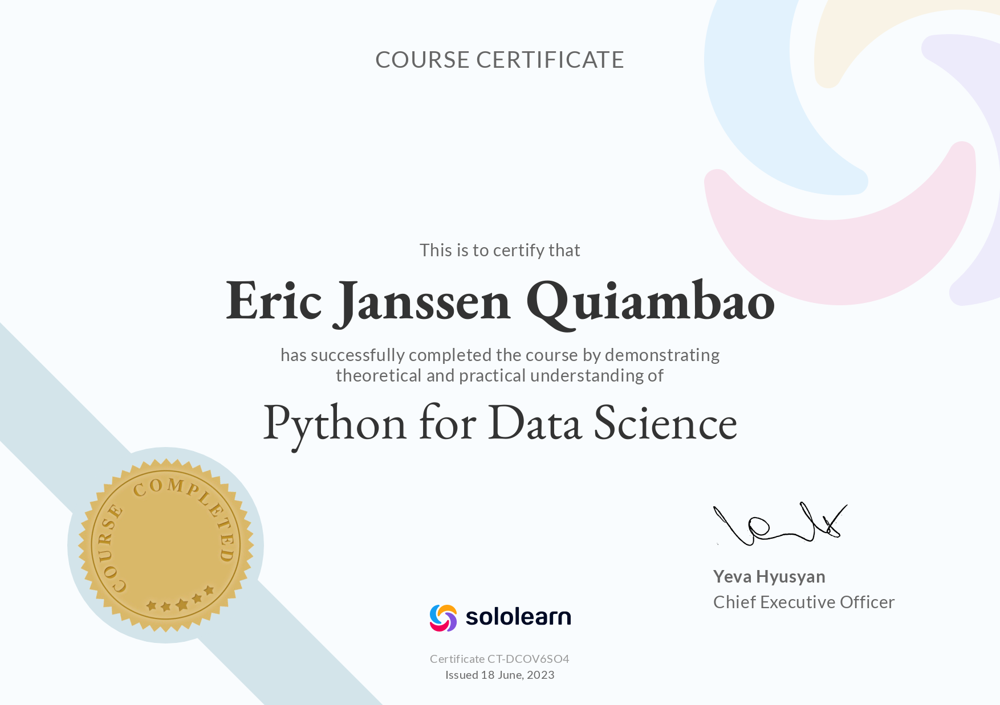

 

# 🛹🏍️ Ensues 🎸📖

**`Digital Craftsman (Developer / Designer / Programmer)`**

I'm a 3rd Year <b> Bachelors Of Science In Computer Science </b> student at <b> Tarlac State University </b> helping in building the digital world one step at a time. My coding projects were built from the ground up, from planning and designing all the way to solving real-life problems with code. I like designing, data, and money 🎨📊💸

As of now I'm interested and studying in three fields:
- <b> Full Stack Web Development </b> - HTML, CSS, & JavaScript 
- <b> Data Science </b> - Python { Numpy, Pandas, Matplotlib }, Java, & Excel | Sheets
- <b> Quant Analyst </b> - Python { Numpy, Pandas, Matplotlib } & Java

   
  
    
  
  
  
  
  

  

  
  

###

  <h2 align="center"> 🧰 Skills & Technologies 🗣️ </h2> 

   
  
  #### Languages
  
  
  
  
  
  
  
  
  <!--- 
  
  
  --->
  
  
  
  

  #### Data Science & Quant Analysis 
  
  
  
  
  
  

  #### IDEs
  
  
  
  
  <!--- 
  
  
  -->

  #### Tools & Tech
  <!--- 
  
  
  -->
  
  
  

 

<!--- 

    <h2> 👨‍🎓 Certificates 🖼️ </h2> 
    

--->

  <h2> 💽 Repository Info 💾</h2>

  
   
  
   

  

  

  

---

  

    <h3>"You'll never know how good you might have become unless you try"</h3>
    <h4> - Mike Mentzer </h4>
  

